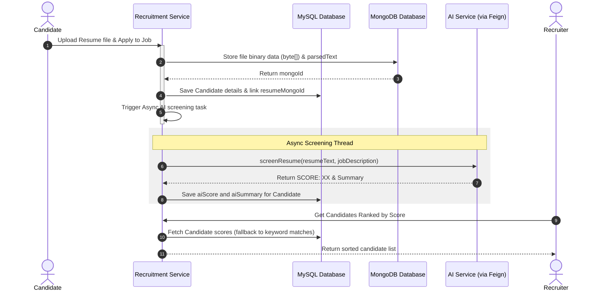

# RevTalent Recruitment & Applicant Tracking Service

The **Recruitment Service** handles candidate job applications, resume storage, parsed text matching, and AI-assisted screening analysis inside the **RevTalent** microservices ecosystem.

---

##  Recruitment & Screening Workflow

The service integrates standard keyword matching with advanced asynchronous AI scoring:

### 1. Job Posting & Application
- recruiters create `JobPosting` vacancies in the MySQL database.
- Candidates apply by uploading their CV files.
- The **Resume Service**:
  - Saves file metadata, raw bytes (`fileData`), and basic extracted text (`parsedText`) in **MongoDB** (the `resumes` collection).
  - Obtains the unique MongoDB document ID and stores it as a foreign link (`resumeMongoId`) in the MySQL `Candidate` record.

### 2. Candidate Match Calculations
The system calculates candidate fit in two ways:
- **Keyword Match**: Calculates the ratio of matching terms between job requirements and extracted resume text.
- **AI Scoring (Asynchronous)**:
  - An `@Async` thread sends the resume text and job description to the **AI Service** via an OpenFeign client.
  - It parses the response for standard score definitions (e.g. `SCORE: 85`), updates the candidate's `aiScore` and `aiSummary` columns in MySQL, and commits.

### 3. Hiring & Ranking List
- Recruiters request candidate ranking lists for specific jobs.
- The service orders applicant records by score descending (using AI scores if available, falling back to keyword scores).

---

##  Dependencies Added

The following packages are declared in this service's `pom.xml`:

- **Spring Data MongoDB** (`spring-boot-starter-data-mongodb`): Configures and stores document files and raw resume data in MongoDB.
- **Spring Cloud OpenFeign** (`spring-cloud-starter-openfeign`): Provides declarative HTTP client interfaces (`AiServiceClient`) to call the AI Service.
- **Spring Boot Data JPA** (`spring-boot-starter-data-jpa`): Connects MySQL for core candidate records and vacancy states.
- **Spring Boot Security & JJWT**: Exposes JWT authentication filters at the API level.
- **Spring Boot Web** (`spring-boot-starter-web`): Exposes endpoint routes.
- **MySQL Driver** (`mysql-connector-j`): SQL driver runtime library.
- **Netflix Eureka Client** (`spring-cloud-starter-netflix-eureka-client`): Eureka discovery registration.
- **Spring Cloud Config Client** (`spring-cloud-starter-config`): Pulls server configuration settings at startup.
- **Lombok** (`lombok`): Generates getters, setters, constructors.
- **Jacoco Testing Quality Gate** (`jacoco-maven-plugin`): Monitors unit testing coverage.
